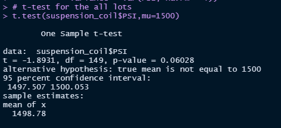
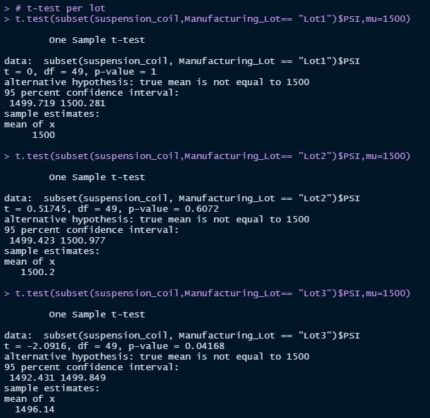

# MechaCar_Statistical_Analysis
You can find the Analysis file here: [MecaCarChallenge.R](https://github.com/NedaAJ/MechaCar_Statistical_Analysis/blob/main/MecaCarChallenge.R)

## Project Overview
The project's purpose is to evaluate vehicle performance across different manufacturer lots and examine parameters that might impact the construction of a new automobile prototype. These metrics include vehicle length, weight, spoiler angle, ground clearance, AWD capabilities, MPG, and PSI.
## Linear Regression to Predict MPG

3 main outcomes:
- A non-random variable's variance is usually zero. Given this, the intercept, vehicle length, and ground clearance coefficients can be considered to provide non-random mpg variance.
- Because of the exceedingly small p-value, we can reject the null hypothesis at a significance level of 0.05. In a linear regression, the null hypothesis argues that the slope (1) is equal to 0. If we reject the null hypothesis, however, we're saying that alternative (1 0) is correct. As a result, the slope is not zero.
- As additional variables are processed through the regression, the multiple R-squared grows. Adjusted R-squared, on the other hand, accounts for this rise and includes penalties for the amount of predictors in the model, making it a more accurate predictor of the linear model's effectiveness. With a modified R-square of 0.6825, this linear model can reasonably estimate the mpg of MechaCar prototypes.

## Summary Statistics on Suspension Coils

  

  

The aggregate variance for the whole dataset reveals that the present manufacturing data fulfils the variance constraint of 100 pounds per square inch. However, when the three lots are split, the third lot has a substantially greater variance. Because the lots are picked at random, it's possible that a third of them will fall short of the required suspension coils.

## T-Test on Suspension Coils
### T-Test on Entire Lot

The null hypothesis is not rejected at a significance level of 0.05 since the p-value equals 0.06. As a result, we can't rule out the possibility that the sample mean is the same as the genuine population mean. The small confidence interval is another trait worth noting. A tighter confidence interval gives more accuracy than a broader interval, despite the fact that it has a lower likelihood of collecting an observation inside it.

### T-Test on Three Smaller Lots

#### Lot 1 :
The null hypothesis is not rejected at a significance level of 0.05 since the p-value equals 1. The relationship between p-values and confidence intervals is intriguing in that as p-values increase, the confidence interval shrinks, reflecting more precision in forecasting the real population mean.
#### Lot 2 :
We fail to reject the null hypothesis at a significance threshold of 0.05 since the p-value equals 0.6072. The confidence interval for the second lot is similarly rather modest.

#### Lot 3
We may reject the null hypothesis at a significance level of 0.05 since the p-value equals 0.04168. In compared to the previous two lots, the mean of this sample is similarly much lower. Furthermore, unlike the previous two lots, the third lot's confidence interval excludes the estimated population mean.

## Study Design: MechaCar vs. Competition

## Contact:
- Email : [neda.ahmadi.jesh@gmail.com](mailto:neda.ahmadi.jesh@gmail.com?subject=[GitHub]%20Source%20Han%20Sans)
- Linkedin: www.linkedin.com/in/neda-ahmadi-j
