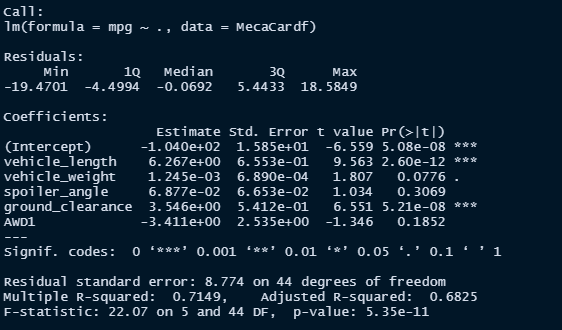

# MechaCar_Statistical_Analysis
You can find the Analysis file here: [MecaCarChallenge.R](https://github.com/NedaAJ/MechaCar_Statistical_Analysis/blob/main/MecaCarChallenge.R)

## Project Overview
The project's purpose is to evaluate vehicle performance across different manufacturer lots and examine parameters that might impact the construction of a new automobile prototype. These metrics include vehicle length, weight, spoiler angle, ground clearance, AWD capabilities, MPG, and PSI.
## Linear Regression to Predict MPG

3 main outcomes:
- A non-random variable's variance is usually zero. Given this, the intercept, vehicle length, and ground clearance coefficients can be considered to provide non-random mpg variance.
- Because of the exceedingly small p-value, we can reject the null hypothesis at a significance level of 0.05. In a linear regression, the null hypothesis argues that the slope (1) is equal to 0. If we reject the null hypothesis, however, we're saying that alternative (1 0) is correct. As a result, the slope is not zero.
- As additional variables are processed through the regression, the multiple R-squared grows. Adjusted R-squared, on the other hand, accounts for this rise and includes penalties for the amount of predictors in the model, making it a more accurate predictor of the linear model's effectiveness. With a modified R-square of 0.6825, this linear model can reasonably estimate the mpg of MechaCar prototypes.

## Summary Statistics on Suspension Coils

## T-Test on Suspension Coils
### T-Test on Entire Lot

### T-Test on Three Smaller Lots
#### Lot 1

#### Lot 2

#### Lot 3

## Study Design: MechaCar vs. Competition